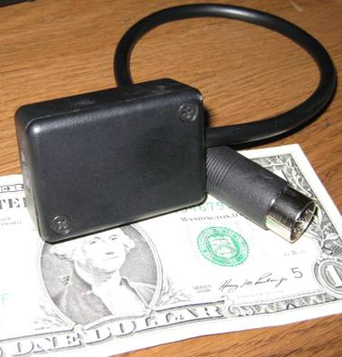
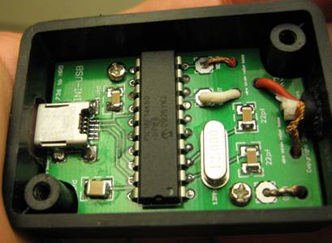
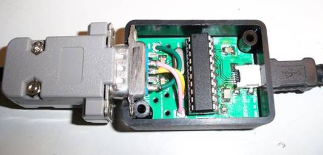
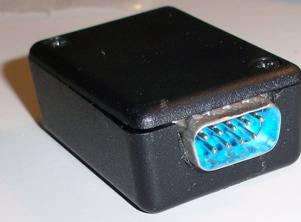
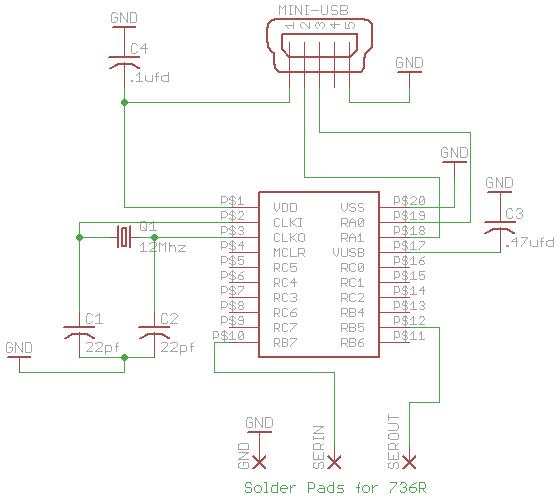
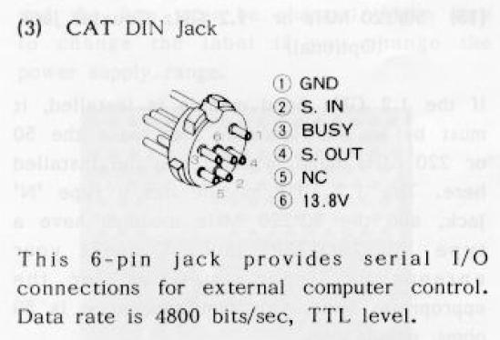

# FT-847 Hardware Emulator for the FT-736R

Archived from Dave KA6BFB’s Comcast page, captured
[25 Dec 2011](https://web.archive.org/web/20111225054335/http://home.comcast.net/~tinkyr/736/N6BIL%20Hardware%20Emulator.htm).
Downloads below point at files already in this folder or at the Ham Spot
copies in the rest of the tree.

Chuck, N6BIL, has implemented a hardware version of the emulator project.
All of the information needed to make your own is available here. The PCB
is available from the Batch PCB company as shown below. The HEX file for
programming the microcontroller is provided, but you will have to arrange
for the programming of the device yourself.

The finished product works extremely well. Frequency corrections for Doppler
shift can be made even while transmitting. Once configured properly,
operation is quite seamless. To use the emulator, connect the emulator to a
USB port and once it is recognized, it will appear as a serial port on the
computer. Go into HRD and select a new connection to an FT-847 at the com
port that corresponds to the emulator and at a port speed of 4800. Press
the connect button, and that’s it!

Most of the modes of the ’847 work with the FT-736. The 847 was also an HF
radio, so obviously the 736 will not accommodate HF frequencies if you try
that. The 736 can also support 220 MHz and 1.2 GHz, which the 847 could
not. You can get 220 operation simply by moving HRD to 220 MHz. 1.2 GHz
operation is just a little more tricky. The 1.2 GHz band is
1240–1299.995 MHz. Since HRD in the 847 mode does not display this range, a
small trick has been incorporated. Drop the 1000 MHz digit and then go to
the frequency you want. For example, to go to 1247.660, go to 247.660 in
HRD.

Another item to look for while in satellite mode is outlined in the 736
manual. The radio cannot transmit and receive with the same band module.
This may result in some confusing situations if you accidentally try this.
If you need to listen on 144 MHz and transmit on 440 MHz and the radio is
already setup in the opposite condition, you will run into the problem when
you try to change one of the bands because you can only change one
frequency at a time and the radio will reject your change because it seems
like you want to have both transmit and receive on the same band. The way
to fix this is simple. Get out of the CAT mode, and press the “REV” button
and this reverses the bands associated with RX and TX. Then reconnect with
HRD and everything will be fine.

Chuck has made some videos along the way for the project construction. They
can be viewed on his YouTube site at
<http://www.youtube.com/user/zdz801>

Here are a few pictures of the completed project.

This is Chuck’s implementation (N6BIL).

These two are my (KA6BFB) version using a DB9 connector.

## Project Related Components

### Schematic

Ham Spot CAD for the production board is
[`Hardware/Eagle/HS-736USB.sch`](../Hardware/Eagle/HS-736USB.sch)
and [`Hardware/Eagle/HS-736USB.brd`](../Hardware/Eagle/HS-736USB.brd).
N6BIL’s original Eagle files are in [`PCB Files.zip`](PCB%20Files.zip)
(`736R_HRD rev1.sch` / `.brd`).

### Connection to DIN Plug

As shown in the schematic above, three wires are used to connect with the
736. One is ground and the other two are signals. These signals are already
at TTL levels, so no inversion and level translation is required. A cable
coming out of the box going directly to the 6 pin DIN plug, or a DB9
intermediate connector can be used. Either way, the following must
ultimately happen:

- Pin 10 of the IC must connect to Pin 2 of the DIN Connector
- Pin 12 of the IC must connect to Pin 4 of the DIN Connector
- GND on the PCB must connect to Pin 1 of the DIN connector

The image below is taken from the 736 Manual and shows the pin out of the
DIN connector.

The same drawing is Fig. 6 in the operating manual:
[`Manual/figures/fig-cat-din.png`](../Manual/figures/fig-cat-din.png).
Use the AMSAT pin map in [`Arduino/docs/CONNECTIONS.md`](../Arduino/docs/CONNECTIONS.md)
— some printings number the shell differently.

### Bill of Materials

| Part | Value | Device | Package | Comment |
| --- | --- | --- | --- | --- |
| C1 | 22 pF | Cap | 1206 | |
| C2 | 22 pF | Cap | 1206 | |
| C3 | .47 uF | Cap | 1206 | |
| C4 | .1 uF | Cap | 1206 | |
| Q1 | 12 MHz | CRYSTAL | HC49 | Digikey P/N [X1037-ND](http://search.digikey.com/scripts/DkSearch/dksus.dll?Detail&name=X1037-ND) or equivalent |
| U$1 | PIC 18F14K50 | DIP IC | 20 Pin DIP | Digikey P/N [PIC18F14K50-I/P-ND](http://search.digikey.com/scripts/DkSearch/dksus.dll?Detail&name=PIC18F14K50-I/P-ND) \*\*\* |
| X1 | MINI B USB | Connector | UX60-MB-5ST | Digikey P/N [H2959DKR-ND](http://search.digikey.com/scripts/DkSearch/dksus.dll?Detail&name=H2959DKR-ND) |
| | | connector | DIN 6 Pin | DigiKey P/N [CP-1060-ND](http://search.digikey.com/scripts/DkSearch/dksus.dll?Detail&name=CP-1060-ND) |
| BOX | 1551GBK | Enclosure | Hammond 1551GBK | Digikey [HM375-ND](http://search.digikey.com/scripts/DkSearch/dksus.dll?Detail&name=HM375-ND), Mouser 546-1551GBK, All Electronics 1551-GBK |
| PCB | | | | [Batch PCB product 54406](http://www.batchpcb.com/index.php/Products/54406) (historical; Batch PCB is gone) |

Ham Spot’s BOM for the later board is [`Hardware/Eagle/bom.txt`](../Hardware/Eagle/bom.txt).
Enclosure artwork is under [`Hardware/Cabinet/`](../Hardware/Cabinet/).

\*\*\* Note. If you cannot program the device yourself, Chuck will program
the device for you at no charge. Just send the device to Chuck with return
postage to Chuck Jones, 1110 Christopher Court, Hollister, CA, 95023.

N6BIL also has set up a project parts list at Mouser. The link is
<https://www.mouser.com/ProjectManager/ProjectDetail.aspx?AccessID=5f0043a1df>

N6BIL’s file describing driver selection
[here](736R_HRD%20tester%20info%20sheet.doc).

### Drivers

ZIP file containing driver files [here](HRDto736_Driver.zip)
(`mchpcdc.inf`, `usbser.sys`).

### PCB Files

Eagle PCB files [here](PCB%20Files.zip) in case you want to make your own
PCB. Otherwise simply purchase the finished PCB from Batch PCB as described
in the Bill of Materials above.

Ham Spot production CAD (not the N6BIL rev1 zip):
[`Hardware/Eagle/`](../Hardware/Eagle/).

### Software

All that is required is the HEX file to program the microcontroller. The
HEX file is available [here](Hex%20File.zip) (`Project 4.hex`). The HEX
file is all that is required to program the microcontroller.

The Ham Spot binary is [`Firmware/HS-736USB.hex`](../Firmware/HS-736USB.hex).

If you want to look at all the original source code, it is available
[here](Source%20code%20package.zip).

The same sources live unpacked in [`Firmware/Source/`](../Firmware/Source/).
