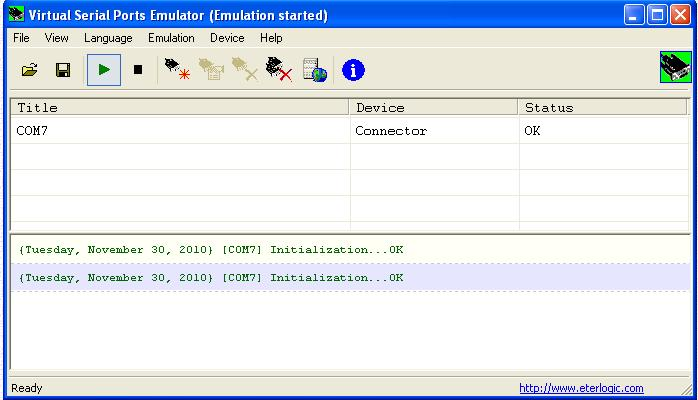
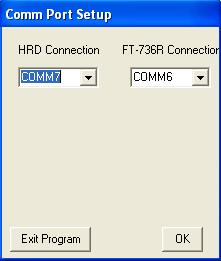
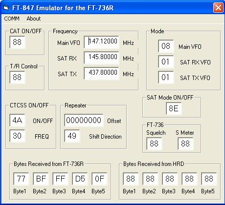
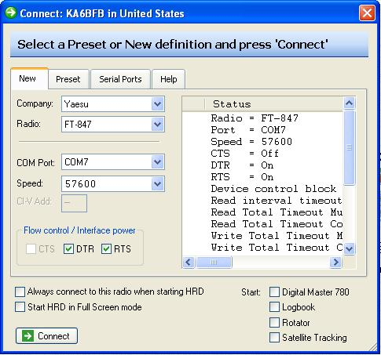
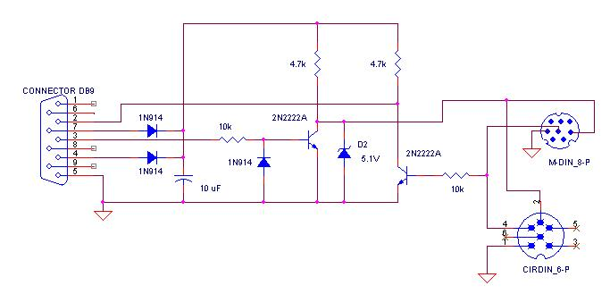

# FT-847 Windows Emulator for the FT-736R

Archived from Dave KA6BFB’s Comcast page, captured
[11 Jun 2015](https://web.archive.org/web/20150611033646/http://home.comcast.net/~tinkyr/736/KA6BFB%20Windows%20Emulator.htm).
The installer is [`736 Windows Emulator.ZIP`](736%20Windows%20Emulator.ZIP)
in this folder.

This software will enable you to use the FT-736R with Ham Radio Deluxe.
This is offered with **absolutely no support** other than what has been
provided here. I have had many requests for this software, but I can not
spare the time for support. Three other people have gotten this to work
with the information below with no problems.

This software was never meant to be used outside of my house, so it is not
polished. It can be seen in use at
<http://www.youtube.com/watch?v=7H98FBQZJ_A>.

The software can be downloaded here:

[736 Windows Emulator.ZIP](736%20Windows%20Emulator.ZIP)

(`emulator setup.doc`, `FT847 Emulator.CAB`, `setup.exe`, `SETUP.LST`)

Here are the brief instructions for making it work. These are included in
the download as well.

You can use three serial ports, or use a free Serial port emulator. I will
show the serial port emulator method here. First, download the emulator at
<http://www.eterlogic.com/Products.VSPE.html>

Open the serial port emulator and create a virtual port. This should be a
port number that does not exist in hardware. This will be what HRD uses to
talk to. In this case below, I created Com Port 7. It is referred to as a
connector, and unlike real serial ports, two devices can connect to it
forming a virtual serial bridge.

Next, Open up my 847 Emulator and you will get the screen below

HRD com port is the virtual one you just set up.

The 736 port is an actual hardware port that exists on your computer and
used to connect to the 736. See RS-232 interfacing section below hardware
details.

After this is set up, click ok and you will see the following which are the
values of data that are stored from HRD and read back to HRD. These values
are also used to communicate with the 736. The commands are obviously
different, so conversion occurs.

Now you are ready to open HRD. My values are shown below. Your serial ports
will probably be different. After all is setup, connect and enjoy the
emulator. After all of this, you can see why I don’t want to release this.

The same HRD Connect window is Fig. 9 in the operating manual:
[`Manual/figures/fig-hrd-connect.png`](../Manual/figures/fig-hrd-connect.png).

## RS-232 Interfacing

There seems to be some confusion about the serial interfacing. Yaesu made
an interface that had a 25 pin serial connector and the appropriate DIN
connector at the other end. These are fairly uncommon these days. The 736
at the DIN connector is expecting TTL levels, so yes inversion and level
shifting is required. Here is a schematic of the circuit I made a while
back. I have two DIN connectors on the output so that I can use it on older
radios like the 736 and newer radios like the FT-817.

The N6BIL USB box does **not** need this level shifter: its UART is already
TTL. See [`Hardware.md`](Hardware.md).
The Ham Spot / Arduino CAT pin map (AMSAT) is in
[`Arduino/docs/CONNECTIONS.md`](../Arduino/docs/CONNECTIONS.md).
